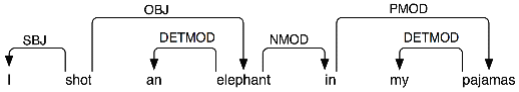
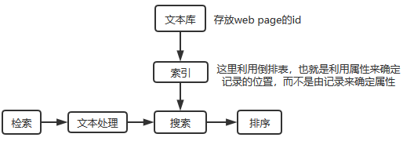

### 自然语言处理(NLP)

> NLP是机器学习的一个领域，专注于理解与人类语言相关的一切。NLP任务的目的不仅是单独理解单个单词，而是能够理解这些单词的上下文。

自然语言处理NLP可以看成两部分之和：自然语言理解(NLU)+自然语言生成(NLG)

* NLU是从语音或文本中理解其意思含义。目的是Understanding。
- NLG是从理解的意思中生成语音或文本。目的是Generate。

#### NLP任务列表

以下是常见NLP任务的列表，以及每个任务的一些示例：

* **分词tokenize**  分析词语并标记成tokenize

* **词性标注POS** 标示名词、动词、形容词等等

* **命名实体识别**

* **句法分析(Syntatic Analysis)** 分析句子是主谓宾还是结构

* **语义分析(Semantic Analysis)** 单词/句子/文章的含义等等

#### 分词(tokenize、word segmentation)

英文分词：英文句子不同的单词之间有空格，所有英文句子很好进行分词，就直接根据空格把所有的单词提取出来即可。

例如：

"I am happy" --->分词后： "I"、"am"、"happy"。

中文分词：中文句子中的词没有空格之类的进行隔开，所以需要一些方法把中文中的词语划分出来。有时模型直接利用字而不是词，所以可能直接对句子直接切成字。

例如：

"生活在现实世界的我不能活在理想中" ---> "生活 在 现实 世界 的 我 不能 活 在 理想 中"

对于中文中词语的划分有不同的算法，其中最简单的算法：最大匹配分词算法等。

> 最大匹配分词算法就是利用一个滑动的窗口(从前往后或者从后往前)来判断当前窗口内的内容是否在词典(相当于中文词典，包含了中文里所有可能的词语)中，如果不在，将该窗口中的词一个一个去掉再进行匹配，匹配到的话就从该位置分词，继续对后面窗口进行上述过程。

中文分词工具和算法：

jieba分词；SnowNLP；LTP；HanNLP等等。

#### 词性标注(Part-Of-Speech tagging)

词性标注：句子中的每个单词被分类 为一种词性，如动词、名词。

词性标注的过程依耐当前单词以及它的上下文信息，这类问题也叫做序列标注(CRF模型)问题，可以理解为分类问题：

* 方案一：对每个单词独立地去做分类。

* 方案二：对于当前单词以及上下文单词提取特征，并用这些特征去做分类。(提取的特征可以是当前单词的本身、当前单词中的字符串、当前单词的字符数、当前单词是否大写开头、其他上下文单词)

词性标注任务可以认为是已解决的问题Solved Problem。

#### 命名实体识别(NER)

实体：人名、位置、时间、组织等等以及其他的实体类型(Other)。

NER的本质是对句子中的每个token打标签，判断每个token的类别。

NER也可以看做以解决问题Solved Problem，现在的识别效果已经很不错了。

#### 句法分析(Syntatic Analysis)

句法分析：对于一个句子的词语语法做分词，比如：主谓宾。

给定一个句子，根据句子的语法grammer来分解。

依存句法分析(Dependency Parsing)：关注的是词和其他词之间的关系。依存关系是一个中心词与它的依耐之间的二元对称关系。一个句子的中心词通常是动词，所有其他的词要么依耐于中心词，要么依耐路径与它的连通。依存关系图如下图所示，依耐关系可以表示为一个加标签的有向图，箭头从中心词指向它们的依耐。

其中，"shot"是整个句子的中心词，"I"是"shot"的主语(SBJ)，"in"是"elephant"的的名词修饰词，"elephant"是"shot"的宾语(OBJ)。

#### 语义分析(Semantic Analysis)

语义理解的主要两个问题：

* 如何理解一个单词的意思？

* 如何理解一个句子的意思？

对于上面这样的问题主要解决的技术/模型有：

* SkipGram, CBOW, Glove, ELMo, BERT, ALBERT

* XLNet, GPT-2, GPT-3, Tiny-BERT

#### NLP常见的应用

##### 写作助手

顾名思义就是对一个句子进行语法上的检查以及给出改进建议(通过大家都在用的写作习惯来推荐)。这个任务可以利用的是语言模型。

##### 文本分类

文本分类又包括：情感分析(sentiment analysis)、情绪分析(emotion analysis)、主题分析(topic classification)。

情绪分析可以用于自动驾驶的场景，比如自动驾驶系统分析用户的情绪比较暴躁，可以进行减速等等的操作；或者是在智能家居中，智能设备分析出用户情绪比较低落可以进行一些操作；以及用在微博的博文中的情绪分析，如果一个用户总是发十分抑郁的内容可以进行一些操作，或者经常发动乱的信息可以提前进行一些控制防止其出现恐怖活动等等。

主题分类就可以应用在生活的方方面面，比如对新闻的文章进行一个主题分类。

##### 信息检索(Information Extraction)

信息检索也就是搜索引擎，算是NLP领域应用最成熟、成功的场景。

返回给用户答案的列表，用户从列表中选取自己想要的答案。

##### 问答系统

问答系统的目的是直接提供给用户答案，而检索系统返回的是相关结果。所以，问答系统需要更多的**语义方面的理解**。

问答系统中的**问题类型**：

1. 事实问题(Factoid Question)。比如问who/what/when/where等。
2. 非事实性的问题(Non-Factoid Question)。比如问How/Why。

##### 自动生成文本摘要

从一大推文本中抽取中一段摘要。总体来说有两种方法：

1. 提取式方法(Extractive Method)。从一大段文本中找到重要的句子，然后将它们整合到一起。重点在于找到重要的句子，也就是对文本中句子的重要性作排序。
2. 抽象式方法(Abstractive Method)。首先理解一大段文本的意思，然后生成摘要。

##### 机器翻译

机器翻译的方法主要有： Rule-based Method 以及 Statistical Method。

基于规则的方法可能是利用语法树来进行翻译。
