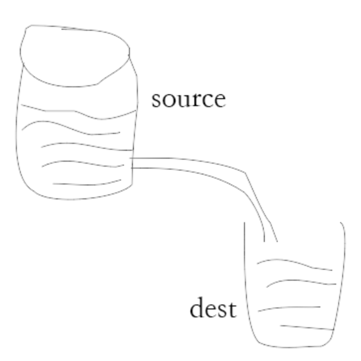

## Node.js  基础篇

### REPL(交互解释器)

> Node.js REPL(Read Eval Print Loop: 交互解释器)类似Unix/Linux shell，我们可以在终端中输入命令，并接收系统的响应。
> 
> Node自带了交互式解释器，可以执行以下任务：

* 读取    读取用户输入，解析输入的Javascript数据结构并存储在内存中。

* 执行    执行输入的数据结构。

* 打印    输出结果。

* 循环    循环操作以上步骤到用户两次按ctrl+c按钮退出。   

打开终端，输入node,即可进入REPL交互解释器。

```shell
$ node
> 
```

这里就可以在>后输入简单的表达式，回车来显示结果

例如：

```shell
$ node
> 1+4
5
```

### 回调函数

> Node.js异步编程的直接体现就是回调。异步编程依托回调来实现，但不能说使用了回调后程序就是异步化了。
> 
> 回调函数在完成任务后就会被调用，Node 使用了大量的回调函数，Node 所有 API 都支持回调函数。
> 
> 例如： 一边读取文件，一边执行其他的命令，在文件读取完成后，将文件内容作为回调函数的参数返回，这样在执行代码时就没有阻塞或等待文件I/O操作。这就大大提高了Node.js的性能，可以处理大量的并发请求。

异步代码实例：

```js
const fs = require("fs");

// 文件读取后，异步执行处理
fs.readFile("test.txt",function(err,data){
    if(err) return console.error(err);
    console.log(data.toString());
});
```

### 事件驱动编程

> 事件驱动编程是一种编程范式，其中程序的执行流程取决于事件的发生和处理。在传统的命令式编中，程序按照预定的顺序依次执行。而在事件驱动编程中，程序通过监听事件来相应的触发回调函数来执行。这种模式可以提高并发性和可扩展性，尤其适用于大量并发请求的情况。

#### 1. EventEmitter

> EventEmitter是Node.js中内置的一个核心模块。
> 
> Node.js所有的异步I/O操作在完成时都会发送一个事件到事件队列。
> 
> Node.js里面的许多对象都会分发事件：
> 
> * 一个net.Server对象会在每次有新连接时触发一件事件。
> 
> * 一个fs.readStream对象会在文件被打开时触发一个事件。
> 
> * ...
> 
> 所有这些产生事件的对象都是events.EventEmitter的实例。

常用的方法：

* on(event, listener)：注册一个事件监听器，当事件被触发时执行回调函数。

* emit(event, [args])：触发事件，并将可选参数传递给事件监听器。

* removeListener(event, listener)：移除指定事件的监听器。

* once(event, listener)：注册一个一次性的事件监听器，该监听器在触发一次后将被移除。

#### 2.事件循环

> Node.js使用事件循环来管理事件的触发和回调函数的执行，事件循环是一个持续运行的进程，它等待事件的触发并调用相应的回调函数。

> 事件循环的主要组成部分：
> 
> * 事件触发器（Event Triggers）：发射事件的对象，可以是 Node.js 的核心模块、自定义对象或第三方模块。
> 
> * 事件队列（Event Queue）：存储待处理事件的队列。当事件被触发时，相关的回调函数会被添加到事件队列中。
> 
> * 事件处理器（Event Handlers）：从事件队列中取出事件及其回调函数，并执行回调函数。
> 
> * 事件循环（Event Loop）：负责不断事件队列中获取事件，并将其分发给对应的事件处理器进行处理。

事件循环图如下：

 

#### 3. 实例代码:

##### 1. 简单实例

代码文件：event-emitter.js

```js
// 引入events内置模块
const events = require("events");
// 创建一个eventEitter对象
const eventEmitter = new events.EventEmitter();

// 创建事件处理程序
const connectHandler = function connected(){
    console.log("连接成功");
};

// 绑定一个connect事件处理程序
eventEmitter.on("connect",connectHandler);

// 触发connect事件
eventEmitter.emit("connect");
```

##### 2. 多个事件处理

代码文件：event-emitter.js

```js
// 引入events内置模块
const events = require("events");
// 创建一个eventEitter对象
const eventEmitter = new events.EventEmitter();

// 创建事件处理程序
const connectHandler = function connected(){
    console.log("连接成功");

    // 解发另一个数据获取处理事件
    eventEmitter.emit("data_received");
};

// 绑定一个connect事件处理程序
eventEmitter.on("connect",connectHandler);

// 使用匿名函数版定 data_received事件
eventEmitter.on("data_received",function(){
    console.log("数据接收成功。");
});

// 触发connect事件
eventEmitter.emit("connect");
```

##### 3. 带参数的事件处理

代码文件：event-emitter-arg.js

```js
const events = require("events");
const eventEmitter = new events.EventEmitter();

eventEmitter.on("someEvent",function(arg1,arg2){
    console.log("listener1",arg1,arg2);
});

eventEmitter.emit("someEvent","arg1参数","arg2参数");
```

##### 4. 监听器统计

> 如果为特定的事件添加超过设置的监听数量，则EventEmitter会报错，这有助于发现内存泄漏等问题。

代码文件：event-emitter-count.js

```js
const events = require("events");
const eventEmitter = new events.EventEmitter();

// 监听器 #1
const listener1 = function listener1(){
    console.log("监听器 listener1");
}

// 监听器 #1
const listener2 = function listener2(){
    console.log("监听器 listener2");
}

// 绑定 connect事件，处理函数为 listener1
eventEmitter.addListener("connect",listener1);

// 绑定 connect事件，处理函数为 listener2
eventEmitter.on("connect",listener2);

// 查看 connect 监听器数量
const eventListeners = eventEmitter.listenerCount("connect");
console.log(eventListeners + "个监听器监听连接事件。");

// 触发 connect 事件
eventEmitter.emit("connect");

// 移除绑定的 listener1 函数
eventEmitter.removeListener("connect",listener1);
console.log(" listener1 已被移除，不再监听 ");

// 触发 connect 事件
eventEmitter.emit("connect");

// 查看新的监听个数
const eventListeners2 = eventEmitter.listenerCount("connect");
console.log(eventListeners2 + "个监听器监听连接事件。");
```

##### 5. error事件

> EventEmitter定义了一个特殊的事件error，它包含了错误的语义，我们在遇到异常的时候通常会触发error事件。
> 
> 当error事件被触发，EventEmitter规定如果没有响应的监听器，Node.js会把它当作异常，退出程序并输出错误信息。
> 
> 我们一般要为会触发error事件的对象设置监听器，避免遇到错误后整个程序崩溃。例如：

```js
const events = require("events");
const emitter = new events.EventEmitter();
emitter.emit("error");
```

##### 6. 继承EventEmitter

> 大多数时候我们不会直接使用EventEmitter，而是在对象中继承它。包括fs、net、http在内的，只要是支持事件响应的核心模块都是EventEmitter的子类。
> 
> 为什么要这样做呢？原因有两点：
> 
> * 首先，具有某个实体功能的对象实现事件符合语义，事件的监听和发生应该是一个对象的方法。
> 
> * 其次JavaScript的对象机制是基于原型的，支持部分多重继承，继承EventEmitter不会打乱对象原有的继承关系。

代码实例：event-emitter-extends.js

```js
const EventEmitter = require("events");

// 继承 EventEmitter
class EvtDemo extends EventEmitter {};

const myEmitter = new EvtDemo();

myEmitter.on("myEvent",(args)=>{
    console.log("事件被触发，参数为:",args);
});

myEmitter.emit("myEvent","Hello World");
```

#### 结语

> 通过深入了解Node.js的EventEmitter类及其事件处理机制，我们可以灵活地处理和触发事件，实现事件驱动的编程模型。EventEmitter类的方法和事件使得我们能够写出更加灵活和可扩展的代码，提高程序的可读性和可维护性。
> 
> 让我们深入探索和应用Node.js的EventEmitter类，发挥事件驱动编程的威力，开发出更加高效和可靠的应用程序！

### Buffer(缓冲区)

> JavaScript语言自身只有字符串数据类型，没有二进制数据类型。
> 
> 但在处理像TCP流或文件流时，必须使用到二进制数据。因此在Node.js中，定义了一个Buffer类，该类用来创建一个专门存放二进制数据的缓冲区。
> 
> 在Node.js中，Buffer类是随Node内核一起发布的核心库。Buffer库为Node.js带来了一种存储原始数据的方法，可以让Node.js处理二进制数据，每当需要在Node.js中处理I/O操作中移动的数据时，就有可能使用Buffer库。原始数据存储在Buffer类的实例中。一个Buffer类似于一个整数数组，但它对应于V8堆内存之外的一块原始内存。

#### 1. Buffer与字符串编码

> Buffer实例一般用于表示编码字符的序列，比如UTF-8、UCS2、Base64、或十六进制编码的数据。通过使用显式的字符编码，就可以在Buffer实例与普通的JavaScript字符串之间进行相互转换。
> 
> Node.js 目前支持的字符编码包括：
> 
> * **ascii** - 仅支持 7 位 ASCII 数据。如果设置去掉高位的话，这种编码是非常快的。
> 
> * **utf8** - 多字节编码的 Unicode 字符。许多网页和其他文档格式都使用 UTF-8 。
> 
> * **utf16le** - 2 或 4 个字节，小字节序编码的 Unicode 字符。支持代理对（U+10000 至 U+10FFFF）。
> 
> * **ucs2** - **utf16le** 的别名。
> 
> * **base64** - Base64 编码。
> 
> * **latin1** - 一种把 **Buffer** 编码成一字节编码的字符串的方式。
> 
> * **binary** - **latin1** 的别名。
> 
> * **hex** - 将每个字节编码为两个十六进制字符。

代码文件：buffer-string.js

```js
const buf = Buffer.from("hello",'ascii');
// 输出十六进制
console.log(buf.toString('hex'));
// 输出 base64
console.log(buf.toString('base64'));
```

#### 2. 创建Buffer类

> Buffer提供了以下API来创建Buffer类：
> 
> * **Buffer.alloc(size[, fill[, encoding]])：** 返回一个指定大小的 Buffer 实例，如果没有设置 fill，则默认填满 0
> 
> * **Buffer.allocUnsafe(size)：** 返回一个指定大小的 Buffer 实例，但是它不会被初始化，所以它可能包含敏感的数据
> 
> * **Buffer.allocUnsafeSlow(size)** 与allocUnsafe不同，会直接创建缓冲区，速度会比allocUnsafe慢
> 
> * **Buffer.from(array)：** 返回一个被 array 的值初始化的新的 Buffer 实例（传入的 array 的元素只能是数字，不然就会自动被 0 覆盖）
> 
> * **Buffer.from(arrayBuffer[, byteOffset[, length]])：** 返回一个新建的与给定的 ArrayBuffer 共享同一内存的 Buffer。
> 
> * **Buffer.from(buffer)：** 复制传入的 Buffer 实例的数据，并返回一个新的 Buffer 实例
> 
> * **Buffer.from(string[, encoding])：** 返回一个被 string 的值初始化的新的 Buffer 实例

代码示例：

```js
// 创建一个长度为10，且用0填充的Buffer
const buf1 = Buffer.alloc(10);
// Buffer类型 <Buffer 00 00 00 00 00 00 00 00 00 00>
console.log(buf1);

// 创建一个Buffer类，长度为10，且用01来填充
const buf2 = Buffer.alloc(10, 1);
// <Buffer 01 01 01 01 01 01 01 01 01 01>
console.log(buf2);

// 创建一个长度为10，且未初始化的Buffer.
// 这个方法比调用 Buffer.alloc()更快，
// 但返回的Buffer实例可能包含旧数据
// 因此需要使用fill()或write()重写。
const buf3 = Buffer.allocUnsafe(10);
console.log(buf3);

// 创建一个包含 <Buffer 01 02 03> 的Buffer
const buf4 = Buffer.from([1,2,3]);
console.log(buf4);

// 创建一个包含UTF-8字节 <Buffer 74 65 73 74> 的Buffer
const buf5 = Buffer.from("test");
console.log(buf5);

// 创建一个包含Latin-1字节 <Buffer 74 65 73 74> 的Buffer
const buf6 = Buffer.from("test","latin1");
console.log(buf6);
```

#### 3. 写入缓冲区

> 写入Node缓冲区的语法如下:
> 
> ```js
> buf.write(string[, offset[, length]][, encoding])
> ```
> 
> 参数如下：
> 
> * **string** - 写入缓冲区的字符串。
> 
> * **offset** - 缓冲区开始写入的索引值，默认为 0 。
> 
> * **length** - 写入的字节数，默认为 buffer.length
> 
> * **encoding** - 使用的编码。默认为 'utf8' 。
> 
> 根据 encoding 的字符编码写入 string 到 buf 中的 offset 位置。 length 参数是写入的字节数。 如果 buf 没有足够的空间保存整个字符串，则只会写入 string 的一部分。 只部分解码的字符不会被写入。
> 
> 返回值
> 
> 返回实际写入的大小。如果buffer空间不足，则只会写入部分字符串。

```js
buf = Buffer.alloc(256);
len = buf.write("hello wolrd");
console.log("写入字节数："+len);
```

#### 4. 从缓冲区读取数据

> 读取Node.js缓冲区数据的语法如下：
> 
> ```js
> buf.toString([encoding[, start[, end]]])
> ```
> 
> 参数
> 
> * **encoding** - 使用的编码。默认为 'utf8' 。
> 
> * **start** - 指定开始读取的索引位置，默认为 0。
> 
> * **end** - 结束位置，默认为缓冲区的末尾。
> 
> 返回值
> 
> 解码缓冲区数据并使用指定的编码返回字符串。

```js
buf = Buffer.alloc(26);
for (var i = 0 ; i < 26 ; i++) {
  buf[i] = i + 97;
}
console.log(buf.toString('ascii'));       // 输出: abcdefghijklmnopqrstuvwxyz
console.log(buf.toString('ascii',0,5));   //使用 'ascii' 编码, 并输出: abcde
console.log(buf.toString('utf8',0,5));    // 使用 'utf8' 编码, 并输出: abcde
console.log(buf.toString(undefined,0,5)); // 使用默认的 'utf8' 编码, 并输出: abcde
```

#### 5. Buffer转换为JSON对象

> 将Node.js Buffer转换为JSON对象的函数语法如下：
> 
> 当字符串一个Buffer实例时，JSON.stringify()会隐式地调用该toJSON()
> 
> ```js
> buf.toJSON()
> ```
> 
> 返回值： 返回JSON对象。

代码实例：buffer-json.js

```js
// 将Buffer转换为JSON
const buf = Buffer.from([0x1,0x2,0x3,0x4,0x5]);
const json = JSON.stringify(buf);
// {"type":"Buffer","data":[1,2,3,4,5]}
console.log(json);

// 将JSON转换为Buffer
const copy = JSON.parse(json,(key,value)=>{
    return value && value.type === "Buffer"?Buffer.from(value.data):value;
});
// 输出: <Buffer 01 02 03 04 05>
console.log(copy);
```

#### 6. 缓冲区合并

> Node.js缓冲区合并的语法如下：
> 
> ```js
> Buffer.concat(list[, totalLength])
> ```
> 
> 参数
> 
> * **list** - 用于合并的 Buffer 对象数组列表。
> 
> * **totalLength** - 指定合并后Buffer对象的总长度。
> 
> 返回值：返回一个多个成员合并的新Buffer对象。

```js
const buf1 = Buffer.from("Hello ");
const buf2 = Buffer.from("World");
const buf3 = Buffer.concat([buf1,buf2]);
console.log("内容"+buf3.toString());
```

#### 7. 缓冲区比较

> Node Buffer比较的函数是在v0.12.2版本引入：
> 
> ```js
> buf.compare(otherBuffer);
> ```
> 
> 参数：
> 
> * **otherBuffer** - 与 **buf** 对象比较的另外一个 Buffer 对象。
> 
> 返顺值：返回一个数字，表示buf在otherBuffer之前，之后或相同。

```js
const buf1 = Buffer.from("ABC");
const buf2 = Buffer.from("ABCD");
const result = buf1.compare(buf2);
// -1 :buf1字符长度小于buf2，大于0时，buf1字符长度大于buf2，=0时，则两字符长度相同
console.log(result);
```

#### 8.拷贝缓冲区

> Node.js缓冲区拷贝如下：
> 
> ```js
> buf.copy(targetBuffer[,targetStart[,sourceStart[, sourceEnd])
> ```
> 
> 参数
> 
> * **targetBuffer** - 要拷贝的 Buffer 对象。
> 
> * **targetStart** - 数字, 可选, 默认: 0
> 
> * **sourceStart** - 数字, 可选, 默认: 0
> 
> * **sourceEnd** - 数字, 可选, 默认: buffer.length
> 
> 返回值： 没有返回值

```js
const buf1 = Buffer.from("abcdefg");
const buf2 = Buffer.from("hik");
//将buf2插入到buf1指定位置上
buf2.copy(buf1,2);
console.log(buf1.toString());
```

#### 9. 缓冲区裁剪

> Node.js缓冲区裁剪语法如下：
> 
> ```js
> buf.slice([start[,end])
> ```
> 
> 参数
> 
> * **start** - 数字, 可选, 默认: 0
> 
> * **end** - 数字, 可选, 默认: buffer.length
> 
> 返回值： 返回一个新的缓冲区，它和旧缓冲区指向同一块内存，但是从索引start到end的位置剪裁。

```js
const buf1 = Buffer.from("hello world");
// 剪裁缓冲区
const buf2 = buf1.slice(0,2);
console.log("buffer2 content: " + buf2.toString());
```

#### 10. 缓冲区长度

> Node.js缓冲区长度计算：
> 
> ```js
> buf.length;
> ```
> 
> 返回值：返回Buffer对象所占据的内存长度。

```js
const buf = Buffer.from("www.hello.com");
console.log("Buffer length: "+buf.length);
```

### Stream(流)

> Stream是一个抽象接口，Node中有很多对象实现了这个接口。例如，对http服务器发起请求的request对象就是一个Stream，还有stdout(标准输出)。
> 
> Stream有四种流类型：
> 
> * **Readable** - 可读操作。
> 
> * **Writable** - 可写操作。
> 
> * **Duplex** - 可读可写操作。
> 
> * **Transform** - 操作被写入数据，然后读出结果。
> 
> Stream对象都是EventEmitter的实例。常用的事件有：
> 
> * **data** - 当有数据可读时触发。
> 
> * **end** - 没有更多的数据可读时触发。
> 
> * **error** - 在接收和写入过程中发生错误时触发。
> 
> * **finish** - 所有数据已被写入到底层系统时触发。

#### 1.  从流中读取数据

读取test.txt中内容，代码(stream-read.js)如下：

```js
const fs = require("fs");
var data= "";
// 创建可读流
const reader = fs.createReadStream("test.txt");
// 设置编码为 utf8
reader.setEncoding("UTF8");
// 处理流事件 -->data,end, and error
reader.on("data",function(chunk){
    data += chunk;
});
// 流事件结束
reader.on("end",function(){
    console.log(data);
});
// 错误处理
reader.on("error",function(err){
    console.log(err.stack);
});
```

#### 2. 写入流

写入字符内容到output.txt，代码(stream-write.js)如下：

```js
const fs = require("fs");
const data = "www.nodejs.org的教程";
// 创建一个可以写入的流，写入到文件output.txt中
const writeStream = fs.createWriteStream("output.txt");
// 使用utf8编码写入数据
writeStream.write(data,'UTF8');
// 标记文件末尾
writeStream.end();
// 处理流事件 --> finish、error
writeStream.on("finish",function(){
    console.log("写入完成。");
});
// 流错误处理
writeStream.on("error",function(err){
    console.log(err.stack);
});
```

#### 3. 管道流

> 管道提供了一个输出流到输入流的机制。通常我们用于从一个流中获取数拓并将数据传递到另外一个流中。
> 
> 
> 
> 如下图所示，我们把文件比作装水的桶，而水就是文件里的内容，我们用一根管子(pipe)连接两个桶，使得水从一个桶流入到另外一个桶里，这样就慢慢的实现了大文件的复制过程。

代码(stream-pipe.js)如下：

```js
const fs = require("fs");
// 创建一个可读流
const readerStream = fs.createReadStream("test.txt");
// 创建一个可写流
const writerStream = fs.createWriteStream("output.txt");
// 管道读写操作 读取test.txt内容，并将内容写入到output.txt文件中
readerStream.pipe(writerStream);
```

#### 4. 链式流

> 链式是通过连接输出流到另外一个流并创建多个流操作链的机制。链式流一般用于管道操作。
> 
> 利用管道和链式来压缩文件和解压文件。

压缩代码：

```js
const fs = require("fs");
const zlib = require("zlib");
// 压缩 test.txt 为 test.txt.gz
fs.createReadStream("test.txt")
    .pipe(zlib.createGzip())
    .pipe(fs.createWriteStream("test.txt.gz"));
```

解压代码：

```js
const fs = require("fs");
const zlib = require("zlib");
// 解压 test.txt.gz 为 test.txt
fs.createReadStream("test.txt.gz")
    .pipe(zlib.createGunzip())
    .pipe(fs.createWriteStream("test.txt"));
```


### 模块系统

> 模块是Node.js应用程序的基本组成部分，文件和模块是一一对应的。即一个Node.js文件就是一个模块，这个文件可能是JavaScript代码、JSON或者编译过的C/C++扩展等。

#### 1. 引入模块

mods/hello.js模块代码如下：

```js
exports.world = function(){
    console.log("Hello World");
}
```

在mods/test.js中引入hello模块，代码如下：

```js
const hello = require("./hello");
hello.world();
```

hello.js通过exports对象把world函数作为模块的访问接口，然后通过require("./hello")加载这个模块，即可直接访问exports对象的成员函数了。


#### 2. 对象模块

如果希望把一个对象封装到模块中，格式如下：

```js
module.exports = function(){
    // TODO
}
```

例如(mods/md-hello.js)：

```js
module.exports = function Hello(){
    var name;
    this.setName = function(thyName){
        name = thyName;
    };
    this.sayHello = function(){
        console.log("Hello "+name);
    };
};
```

在(mods/md-test.js)中引用：

```js
const Hello = require("./md-hello");
const hello = new Hello();
hello.setName("By Modules");
hello.sayHello();
```

#### 3. 内置模块

> Node.js的内置模块，例如http模块等，可以直接引用，只需将它返回值赋给一个本地变量。

代码示例：

```js
const http = require("http");
...
http.createServer(...);
```

Node.js的require方法中的文件查找策略如下：


#### 4. exports和module.exports

> 如果要对外暴露属性或方法，就用exports就行，要暴露对象(类似class，包含很多属性和方法)，就用module.exports
> 
> 不建议同时使用exports和module.exports。
> 
> 如果先使用exports对外暴露属性或者方法，再使用module.exports暴露对象，会使得exports上暴露的属性或者方法失效。


### 全局对象&全局变量

> JavaScript中有一个特殊的对象，称为全局对象，它及其所有属性都可以在程序的任何地方访问，即全局变量。
> 
> 在浏览器的JavaScript中，通常window是全局对象，而Node.js中的全局对象是global，在ECMAScript 2020出现之后，全局变量是globalThis，在Node.js环境会自动切换成global,浏览器环境自动切换window非常方便。

#### 1. 自定义全局变量

main.js代码如下：

```js
globalThis.version = 2.0
const Hello = require("hello.js");
```

hello.js代码如下：

```js
module.exports = function(){
    console.log(globalThis.version);
}
```

#### 2. 内置全局对象与全局变量

**__filename**

> 执行的脚本的文件名(输出 文件所在的绝对路径)。

**__dirname**

>  当前执行脚本所在的目录。

**setTimeout(cb,ms)**

> 在指定的毫秒数(ms)后执行执定的函数(cb)
> 
> 参数说明
> 
> * cb 为要执行的回调函数
> 
> * 指定的毫秒ms
> 
> setTimeout()只执行一次指定的函数

**clearTimeout(t)**

>  用于停止之前创建的定时器。
> 
> 参数说明
> 
> * t 定时器返回的句柄

time.js代码实例：

```js
function printHello(){
    console.log("Hello World!");
}
// 两秒后执行
let t = setTimeout(printHello,2000);
// 清除定时器
clearTimeout(t);
```

**setInterval(cb, ms)**

> 与setTimeout不同是，这个方法会不停地调用函数，直到clearInterval()被调用或窗口被关闭。
> 
> 参数同setTimeout

**clearInterval(t)**

> 清除setInterval定时器
> 
> * t setInterval定时器句柄

**console**

> console用于提供控制台标准输出，Node.js沿用浏览器的实施标准。
> 
> **console.log(data)**  输出字符串，可接收若干参数。
> 
> **console.info(data)** 与console.log差别不大，返回信息性消息。
> 
> **console.error(data)** 输出错误信息。
> 
> **console.warn(data)** 输出警告信息。
> 
> **console.dir(obj[,options])** 用来对一个对象进行检查，并以易于阅读和打印的格式显示。
> 
> **console.trace(message[,...])** 当前执行的代码在堆栈中的调用路径，这个测试函数运行很有帮助，只要给想测试的函数加入console.trace就行。
> 
> **console.assert(value[,message][,...])** 用于判断某个表达式或变量是否为真，接收两个参数，第一个参数和是表达式，第二个参数是字符串。只有当第一个参数为false,才会输出第二个参数，否则不会有任何结果。

**process**

> process是一个全局变量，即global对象的属性。
> 
> 它用于描述当前Node.js进程状态的对象，提供一个与操作系统的简单接口。

事件方法：

> exit** 当进程准备退出时触发。
> 
> **beforeExit** 当node清空事件循环，并且没有其他安排时触发这个事件。当没有进程安排时node退出，但是beforeExit的监听器可以异步调用，这样node就会继续执行。
> 
> **uncaughtException** 当一个异常冒泡回到事件循环，触发这个事件。如果给异常添加了监听器，默认的操作(打印堆栈跟踪信息并退出)就不会发生。
> 
> **Signal事件** 当进程接收到信号时就触发。

main.js代码如下：

```js
process.on('exit',function(code){
    // 不会执行
    setTimeout(function(){
        console.log("never");
    },0);
    
    // 退出业务逻辑处理
    console.log("退出代码：",code);
});
console.log("程序执行结束");
```

执行main.js文件，结果如下：

```shell
node main.js
程序执行结束
退出码
```

**常用属性或方法**

> stdout  标准输出流。
> 
> stderr   标准错误流。
> 
> stdin     标准输入流。
> 
> argv    返回命令行参数的数组。
> 
> execPath   返回执行当前脚本的 Node 二进制文件的绝对路径。
> 
> execArgv   返回一个数组，成员是命令行下执行脚本时，在Node可执行文件与脚本文件之间的命令行参数。
> 
> env     返回当前环境变量的对象。
> 
> exitCode   进程退出时的代码，如果进程优通过 process.exit() 退出，不需要指定退出码。
> 
> version    Node 的版本。
> 
> cwd()  返回当前工作目录的路径。
> 
> pid      返回当前进程的PID(进程ID)。
> 
> title     进程名，默认值为"node"，可以自定义该值。
> 
> arch   当前 CPU 的架构：'arm'、'ia32' 或者 'x64'。
> 
> platform   运行程序所在的平台系统 'darwin', 'freebsd', 'linux', 'sunos' 或 'win32'。
> 
> exit([code])  退出当前的Node.js进程。您可以提供一个可选的退出码作为参数。

代码(process-alt.js)如下：

```js
// 输出到终端
process.stdout.write("Hello World!" + "\n");
// 通过参数读取
process.argv.forEach(function(val, index, array) {
   console.log(index + ': ' + val);
});
// 获取执行路径
console.log(process.execPath);
// 平台信息
console.log(process.platform);
```

执行process-alt.js，结果如下：

```shell
$ node process-alt.js
Hello World!
0: node
1: /web/www/node/process-alt.js
/usr/local/node/0.10.36/bin/node
darwin
```


### http模块

#### 1. 获取URL路径

> 获取URL路径，需要内置模块http,以及url模块，以下是代码实例

代码文件：http-url.js

```js
const http = require("http");
const url = require("url");
http.createServer(function(req,res){
    let urls = url.parse(req.url);
    let pathname = urls.pathname;
    console.log(pathname); //打印URL路径
    res.writeHead(200,{"Content-Type": "text/plain"});
    res.write(pathname);
    res.end();
}).listen(8888);
```

命令行执行

```shell
node http-url.js
```

可通过浏览器访问http://localhost:8888/start，返回结果为/start。

#### 2. 获取url参数

> 获取url参数，需要内置模块querystring，以下是代码实例

代码文件：http-query.js

```js
const http = require("http");
const url = require("url");
const querystring = require("querystring");

http.createServer(function(req,res){
    let urls = url.parse(req.url);
    let pathname = urls.pathname;
    // console.log(pathname);
    let params = querystring.parse(urls.query);
    console.log(params);
    res.writeHead(200,{"Content-Type": "text/plain"});
    res.write(params);
    res.end();
}).listen(8888);
```

命令行执行

```shell
node http-query.js
```

可通过浏览器访问http://localhost:8888/start?foo=bar&hello=world，可在命令下查看参数数组

#### 3. 基于事件驱动的路由实例

> 根据前面讲的EventEmitter事件驱动，我们可以写一个简单的web框架。

代码(http-router.js)实例如下：

```js
const http = require("http");
const events = require("events");
// 创建eventEmitter对象
const eventEmitter = new events.EventEmitter();
// route 根路径
eventEmitter.on("/",function(method,response){
    response.writeHead(200,{'Content-Type': 'text/plain'});
    response.end("Hello World");
});
// route 404
eventEmitter.on("404",function(method,url,response){
    response.writeHead(404,{'Content-Type': 'text/plain'});
    response.end("404 Not Found");
});
//启动服务
http.createServer(function(request,response){
    //打印当前的url
    console.log(request.url);
    // 分发事件
    if(eventEmitter.listenerCount(request.url)>0){
        eventEmitter.emit(request.url,request.method,response);
    }else{
        eventEmitter.emit("404",request.method,request.url,response);
    }
}).listen(8000);

console.log("Server running at http://127.0.0.1:8000");
```

命令行执行

```shell
node http-router.js
```

通过浏览器访问：

    [http://127.0.0.1:8000/](http://127.0.0.1:8000/) 返回结果: Hello World

    [http://127.0.0.1:8000/not](http://127.0.0.1:8000/not) 返回结果：404 Not Found
